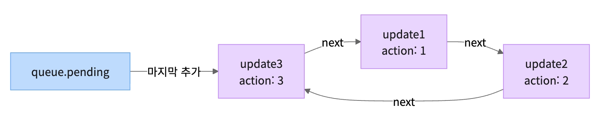

### 📚 Today’s article

https://www.minyeongkim.dev/posts/use-state-internals-fiber-hook-queue

## 1. state는 Fiber의 어디에 저장될까?

- React 컴포넌트는 Fiber로 관리된다
  - 컴포넌트에서 호출될 Hook들은 `Fiber.memoizedState` 필드에 연결리스트로 관리되며, 각 Hook들은 호출 순서대로 연결된다
    ```jsx
    Fiber
    ├─ type
    ├─ key
    ├─ memoizedProps
    └─ memoizedState  ← Hook 연결 리스트의 head
    ```
- Hook 노드는 React에서 [아래 타입](https://github.com/facebook/react/blob/main/packages/react-reconciler/src/ReactFiberHooks.js)으로 정의된다

  ```jsx
  type Hook = {
    memoizedState: any; // 현재 렌더에서 확정된 state 값
    baseState: any;
    baseQueue: Update | null;
    queue: UpdateQueue; // 이 Hook에 연결된 update queue
    next: Hook | null; // 다음 Hook 노드
  };
  ```

  - `Fiber.memoizedState`와 `Hook.memoizedState`는 다른 값임에 주의
    - `Fiber.memoizedState`는 Hook 연결 리스트의 시작 포인터
    - 실제 state 값은 `Hook.memoizedState`에 있다
  - `baseState`와 `baseQueue`는 concurrent rendering에서 사용된다
    - **concurrent rendering**
      - 레거시 React(v18 전)에서 render는 동기적(synchronous)이다
        - render() → 모든 컴포넌트 계산 → commit
        - 한번 시작하면 중단(interrupt)이 불가했기 때문에 리스트 1만개를 렌더링 시작하면 끝날 때가지 다른 작업(클릭이벤트처리 등)은 대기해야 했다
      - v18부터 concurrent rendering이 추가되며 render 중간중간에 브라우저에 제어권을 넘길(yield) 수 있게 된다(interruptible)
        - 작업 → yield → 작업 → yield → …
        - 단어는 동시성이지만 실제로 동시에 실행되는 것은 아님
          - 작업을 쪼개서, 우선순위 기반으로 스케줄링한다
          - high priority를 가지는 작업이 우선 실행되다가, 중간에 필요하다면 다른 작업을 처리하고 low priority 작업을 이어서 처리한다
    - 리액트가 우선순위(lane)에 따라 업데이트 queue의 업데이트들 중 일부를 미룰 수 있다
      - 하나의 업데이트가 쪼개지는 건 아님(run-to-completion)
      - 우선순위는 각 업데이트(queue)의 lane 필드에 정해진다
        - 렌더링할 때 React는 큐를 순회하면서
          - 현재 렌더의 lane에 포함되는 update만 적용
          - 나머지는 건너뜀 (skip)
    - `baseState / baseQueue`는 이렇게 일부 업데이트가 미뤄졌다가 이어서 처리될 때 “어디부터 처리해야 하는지”를 기억하는 역할이다
      - **baseState** → 스킵된 업데이트들을 적용하기 시작할 기준 상태(이전까지 계산된 state)
      - **baseQueue** → 처리되지 않은 update들의 목록

## **2. useState는 어떻게 state를 마운트할까?**

- `useState`는 컴포넌트 첫 렌더링 때 `mountState(initState)`를 실행한다 ([ReactFiberHooks.js - mountState](https://github.com/facebook/react/blob/main/packages/react-reconciler/src/ReactFiberHooks.js))

  ```jsx
  function mountState(initialState) {
    const hook = mountWorkInProgressHook(); // 새 Hook 노드 생성 및 리스트에 연결
    hook.memoizedState = hook.baseState = initialState;

    const queue = {
      pending: null,
      lanes: NoLanes,
      dispatch: null,
      lastRenderedReducer: basicStateReducer,
      lastRenderedState: initialState,
    };
    hook.queue = queue;

    const dispatch = (queue.dispatch = dispatchSetState.bind(
      null,
      currentlyRenderingFiber,
      queue,
    ));
    return [hook.memoizedState, dispatch];
  }
  ```

  - 마운트할 때 해당 useState에 대응하는 Hook 노드를 생성하고 초기 state와 update queue를 설정한다
  - 그리고 개발자가 사용할 `setState`에 해당하는 `dispatch` 함수를 만들어 준다

    ```jsx
    dispatchSetState.bind(null, fiber, queue);
    ```

    - `dispatchSetState`는 Fiber와 queue를 인자로 받고, `bind`를 통해 이 값들을 미리 고정하는 형태로 만들어진다
      - `bind`로 고정해주는 이유는 dispatch가 호출될 때마다 `자신에게` 연결된 queue에 update를 추가해야 하기 때문에 `클로저`로 캡처하는 것이다
      - 즉, `setState`는 state를 직접 변경하는 것이 아니라 **update를 queue에 쌓는 함수인 것이다**

## **3. setState를 호출하면 무슨 일이 일어날까?**

- `setState(action)`이 호출되면 update 객체가 생성된다 ([ReactFiberHooks.js - dispatchSetState](https://github.com/facebook/react/blob/main/packages/react-reconciler/src/ReactFiberHooks.js))

  ```jsx
  type Update<S, A> = {
    lane: Lane; // 업데이트 우선순위
    revertLane: Lane; // optimistic update 롤백용 (React 19)
    action: A; // 새 값(값 교체) 또는 함수(이전 state → 새 state)
    hasEagerState: boolean;
    eagerState: S | null; // 동기 렌더에서 미리 계산한 state
    next: Update<S, A>; // 다음 update (원형 연결)
  };
  ```

  - update queue는 **원형 연결 리스트** 형태이다
    - setState로 생성된 update는 해당 Hook의 `queue.pending`에 연결된다
    - React는 `queue.pending`이 **가장 마지막에 추가된 update**를 가리키도록 유지한다. 그리고 그 update의 `next`는 **가장 처음에 추가된 update**를 가리킨다
      - `setCount(1)`, `setCount(2)`, `setCount(3)`을 순서대로 호출하면 아래와 같은 구조로 저장된다
        
      - `pending.next`로 head(첫 번째 update)에 접근할 수 있다
    - queue에 쌓인 update들은 **다음 렌더 때** useState를 처리하면서 적용된다
      - 렌더가 시작되면 update들을 순서대로 꺼내는 주체는 `updateReducer` 이다
      - 첫 번째 업데이트부터 순서대로 적용해서 계산된 최종 state 값이 `hook.memoizedState`에 저장된다

      ```jsx
      렌더 시작
      → 컴포넌트 함수 실행
      → useState 진입
      → updateReducer 실행 (update queue 처리)
      → 최신 state 계산
      → 그 state로 이후 코드 실행
      → JSX 반환

      위 과정은 렌더 시작 직후 current Fiber Tree를 클론하여 workInProgress Fiber Tree를 생성하고 점진적으로 완성하는 과정으로도 볼 수 있다
      ```

      - 결국 state가 스냅샷처럼 동작하는 이유는 setState를 호출해도 `hook.memoizedState` 값은 다음 렌더에서 새로 갱신되기 때문이다
        ```jsx
        setCount(count + 1);
        console.log(count); // 이전 값이 찍힘
        ```

## 4. Hook의 호출 순서는 항상 같은 순서여야 한다

- 렌더 중 React는 `workInProgressHook`이라는 포인터로 현재 처리 중인 Hook 노드를 추적한다
  - `useState`, `useEffect` 등 Hook이 호출될 때마다 한 칸씩 앞으로 이동
  - Hook 호출 순서와 연결 리스트의 노드 순서가 정확히 일치해야 React가 올바른 Hook에서 state를 읽어올 수 있다
    - 그래서 아래 예시처럼 조건부로 Hook 순서가 달라지는 경우, 두 번째 렌더에서 b는 첫 번째 Hook 자리에 있는 state를 읽고, c는 두 번째 Hook 자리에 있는 state를 읽게 되어 문제를 발생시킨다
      ```jsx
      // 첫 번째 렌더: condition = true
      // 두 번째 렌더: condition = false
      if (condition) {
        const [a, setA] = useState(0);
      }
      const [b, setB] = useState(0);
      const [c, setC] = useState(0);
      ```

## 5. setState가 호출되어도 항상 리렌더링을 발생시키진 않는다

- `dispatchSetState`는 queue에 다른 update가 없을 때(즉, 이 state에 대해 아무 update도 enqueue되지 않은 상태일 때), 다음 state를 미리 계산해 현재 state와 비교한다.
  - **eagerState**: update를 queue에 추가하기 전에 미리 계산한 다음 state 값
- 만약 미리 계산한 다음 state 값이 현재 state와 동일할 경우 `리렌더링을 발생시키지 않는 update`를 등록한다 (**bailout**)

```jsx
// ReactFiberHooks.js — dispatchSetState
const currentState = queue.lastRenderedState;
const eagerState = reducer(currentState, action);
// Object.is => 두 값이 같은지를 비교
if (Object.is(eagerState, currentState)) {
  // 동일하면 bailout
  enqueueConcurrentHookUpdateAndEagerlyBailout(fiber, queue, update);
  return;
}

export function enqueueConcurrentHookUpdateAndEagerlyBailout<S, A>(
  fiber: Fiber,
  queue: HookQueue<S, A>,
  update: HookUpdate<S, A>,
): void {
  // This function is used to queue an update that doesn't need a rerender. The
  // only reason we queue it is in case there's a subsequent higher priority
  // update that causes it to be rebased.
  const lane = NoLane;
  const concurrentQueue: ConcurrentQueue = (queue: any);
  const concurrentUpdate: ConcurrentUpdate = (update: any);
  enqueueUpdate(fiber, concurrentQueue, concurrentUpdate, lane);

  // ...
}
```
